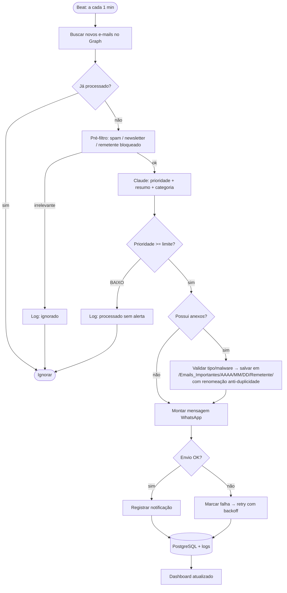

# Fluxograma Operacional

```mermaid
flowchart TD
    A([Beat: a cada 1 min]) --> B[Buscar novos e-mails no Graph]
    B --> C{Já processado?}
    C -- sim --> Z([Ignorar])
    C -- não --> D[Pré-filtro: spam / newsletter / remetente bloqueado]
    D -- irrelevante --> L1[Log: ignorado] --> Z
    D -- ok --> E[Claude: prioridade + resumo + categoria]
    E --> F{Prioridade >= limite?}
    F -- BAIXO --> L2[Log: processado sem alerta] --> Z
    F -- sim --> G{Possui anexos?}
    G -- sim --> H[Validar tipo/malware → salvar em<br/>/Emails_Importantes/AAAA/MM/DD/Remetente/<br/>com renomeação anti-duplicidade]
    G -- não --> I
    H --> I[Montar mensagem WhatsApp]
    I --> J{Envio OK?}
    J -- sim --> K[Registrar notificação]
    J -- não --> R[Marcar falha → retry com backoff]
    K --> M[(PostgreSQL + logs)]
    R --> M
    M --> N[Dashboard atualizado]
```
