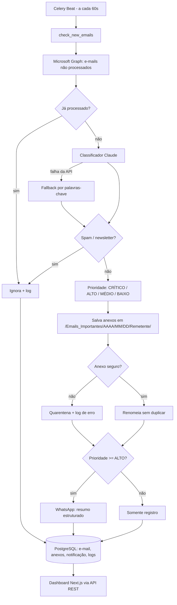

# Fluxograma Operacional

```mermaid
flowchart TD
    A[Celery Beat - a cada 60s] --> B[check_new_emails]
    B --> C[Microsoft Graph: e-mails não processados]
    C --> D{Já processado?}
    D -- sim --> X[Ignora + log]
    D -- não --> E[Classificador Claude]
    E -->|falha da API| F[Fallback por palavras-chave]
    E --> G{Spam / newsletter?}
    F --> G
    G -- sim --> X
    G -- não --> H[Prioridade: CRÍTICO / ALTO / MÉDIO / BAIXO]
    H --> I[Salva anexos em /Emails_Importantes/AAAA/MM/DD/Remetente/]
    I --> J{Anexo seguro?}
    J -- não --> K[Quarentena + log de erro]
    J -- sim --> L[Renomeia sem duplicar]
    L --> M{Prioridade >= ALTO?}
    K --> M
    M -- sim --> N[WhatsApp: resumo estruturado]
    M -- não --> O[Somente registro]
    N --> P[(PostgreSQL: e-mail, anexos, notificação, logs)]
    O --> P
    X --> P
    P --> Q[Dashboard Next.js via API REST]
```
