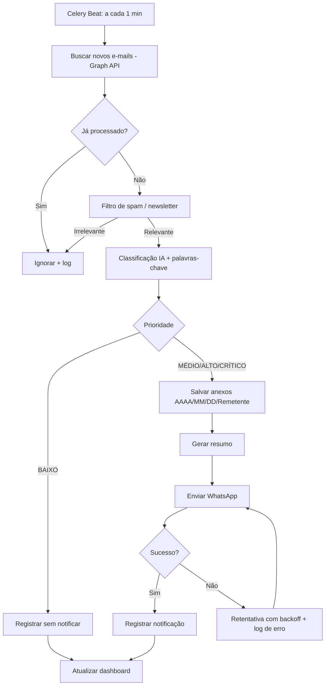

# Fluxograma Operacional

```mermaid
flowchart TD
  A[Celery Beat: a cada 1 min] --> B[Buscar novos e-mails - Graph API]
  B --> C{Já processado?}
  C -- Sim --> Z[Ignorar + log]
  C -- Não --> D[Filtro de spam / newsletter]
  D -- Irrelevante --> Z
  D -- Relevante --> E[Classificação IA + palavras-chave]
  E --> F{Prioridade}
  F -- BAIXO --> G[Registrar sem notificar]
  F -- MÉDIO/ALTO/CRÍTICO --> H[Salvar anexos AAAA/MM/DD/Remetente]
  H --> I[Gerar resumo]
  I --> J[Enviar WhatsApp]
  J --> K{Sucesso?}
  K -- Sim --> L[Registrar notificação]
  K -- Não --> M[Retentativa com backoff + log de erro]
  M --> J
  L --> N[Atualizar dashboard]
  G --> N
```
